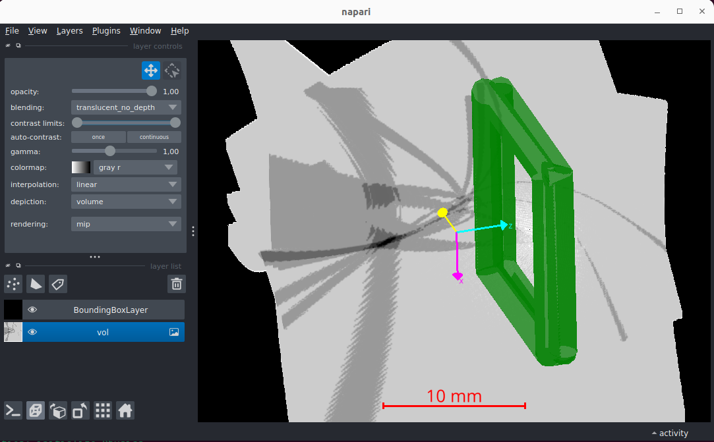

# Timepix3 Compton camera simulation and data processing



A single python script to:
- Simulate particle transport via Geant4 and detector response via Allpix2
- Reconstruct cones from:
  - Geant4/Gate 'hits'
  - Gate 'singles'
  - Allpix2 'pixel hits' (WIP)
  - measured data (WIP)
- Validate simulation/measurement of gamma point sources
- Reconstruct 3D image with basic back-projection
- Visualize 3D images with napari (Linux only)

Requires:
- Linux or MacOS
- 20 GB of disk space
- Python >= 3.10 and pip
- Allpix²
- Optional: CUDA, napari

Tested with:
- OS: Ubuntu 22.04 / 24.04, MacOS 15.4.1 (Allpix² does not support Windows)
- Python: 3.10, 3.11, 3.12 (issue with OpenSSL with 3.9 and opengate-core with 3.13)
- OpenGate: 10.0.1, 10.0.2
- Allpix²: 3.1.0
- GPU: cupy-cuda115/128 + GeForce RTX 2080 Ti

Python3 install by default:
opengate==10.0.0 if 3.9, 3.10
opengate==10.0.2 if 3.11

## Installation

If not already installed, install python (e.g. with pyenv on MacOS) and pip

### 1) Download or clone: 
```
git clone https://github.com/tbilloud/ComptonCamera
```

### 2) Create a virtual environment
```
cd ComptonCamera
python3 -m venv venv
source venv/bin/activate
```

### 3) Install required python packages
`pip install -r requirements-OS.txt` (OS is `linux` or `macos` according to your system)

### 4) Install Allpix2
 
#### Prerequisites Ubuntu 
Tested with Ubuntu 22.04 and 24.04  
Install BOOST `sudo apt-get install libboost-all-dev`      
Install Eigen3 `sudo apt-get install libeigen3-dev`  
Install ROOT6 binary (https://root.cern/install/):  
```
wget https://root.cern/download/root_v6.32.10.Linux-ubuntu22.04-x86_64-gcc11.4.tar.gz
tar -xzvf root_v6.32.10.Linux-ubuntu22.04-x86_64-gcc11.4.tar.gz
source root/bin/thisroot.sh
```

#### Prerequisites MacOS 
Tested with Sequoia 15.4.1
- Install Apple's Command Line Developer Tools `xcode-select --install`
- Install CMake (https://cmake.org/download) and then:
`sudo /Applications/CMake.app/Contents/bin/cmake-gui --install`
- Install ROOT6 (https://root.cern/install). Current version (6.32.12, April 2025):
  - Fails with
    - binary: MacOS 15.4.1 prevents running because of security issues 
    - macports: dependency graphviz fails to install 
    - source: cmake configuration fails, libatomic not found
  - Succeeds with
    - homebrew: installs ROOT 6.34.08 built with C++17 (as of )
- Install BOOST `brew install boost`
- Install Eigen3 `brew install eigen`

#### Then install Allpix2 without Geant4:  
https://allpix-squared.docs.cern.ch/docs/02_installation/  
```
cd allpix
git clone https://gitlab.cern.ch/allpix-squared/allpix-squared
rm -rf .git # remove the git folder to avoid conflicts
cd allpix-squared
mkdir build
cd build
cmake -DCMAKE_INSTALL_PREFIX=../install-noG4 -DBUILD_GeometryBuilderGeant4=OFF -DBUILD_DepositionCosmics=OFF -DBUILD_DepositionGeant4=OFF -DBUILD_DepositionGenerator=OFF -DBUILD_GDMLOutputWriter=OFF -DBUILD_VisualizationGeant4=OFF ..
make -j4
make install
```

### 5) Set environment
```
export GLIBC_TUNABLES=glibc.rtld.optional_static_tls=2000000
```
If using PyCharm: Edit Configurations > Path to ".env files" > /path/Compton-Camera/.env

### 6) Optional: Install GPU tools
To use the GPU-based functions (point source validation, reconstruction):
a) Install CUDA (https://developer.nvidia.com/cuda-downloads)
b) Install the Cupy package suited to your CUDA version, e.g.  
`pip install cupy-cuda115`

## Getting started
Run the test:  
`python3 main_basic.py`  or, if using Allpix2, `python3 main_allpix.py`
The 1st time you run a simulation, Gate10 will install Geant4 datasets, which can take a while. This is done only once.

In main.py, the 1st part (code until block 'ANALYSIS AND RECONSTRUCTION') is the Gate 10 simulation. See user manual:  
https://opengate-python.readthedocs.io/en/master/user_guide/user_guide_intro.html

Then, several functions are available. Step-by-step:
1) Print basic info about Gate output files 
- Gate hits with analyze_hits(). Gate hits are like Geant4 hits and are different from pixel hits.
- singles, which are group of hits per pixel, with analyze_singles()
2) Simulate pixel hits:
- from Gate singles with gSingles2pixelHits()
- from Allpix2 output with gHits2allpix2pixelHits()
3) Reconstruct cones:
- from Gate4 hits with gHits2cones_byEvtID()
- from pixel hits (WIP)
4) Check cones from a point sources:
- validate_psource() plots cone projections. It's slow, ~1 sec per cone.
- with GPU acceleration with validate_psource_gpu()
5) Reconstruct 3D image with:
- simple backprojection with backprojection(). It's slow, ~1 sec per cone.
- PU-accelerated backpropagation with backprojection_gpu()

For Linux users, potting functions using napari are available:
- scroll between cones with plot_stack_napari()
- show reconstructed source and detector geometry in 3D with plot_reconstruction_napari()
Does not work on MacOS yet, see QT/opengate conflict below.

### QT/opengate conflict:
Napari and OpenGate use the same QT backends (PyQt5), which causes conflicts.
Using Qt-based code (e.g. napari) and gate in the same script leads to warning/crashes.  
#### Ubuntu
```
WARNING: QObject::moveToThread: Current thread (0x57ad941535d0) is not the object's thread (0x57ad94c1ef50).
Cannot move to target thread (0x57ad941535d0)
```
Solution:
```
mv /path-to-virtual-environment/lib/python3.XX/site-packages/opengate_core/plugins /path-to-virtual-environment/lib/python3.XX/site-packages/opengate_core/plugins.bak
```
-> replace XX with your python version, e.g. 10

#### Macos
```
objc[16117]: Class QT_... is implemented in both .../opengate_core/.dylibs/QtCore and .../QtCore (0x16c7d1278) ... One of the duplicates must be removed or renamed.
objc[16117]: Class KeyV... is implemented in both .../opengate_core/.dylibs/QtCore and .../QtCore (0x16c7d12a0) ... One of the duplicates must be removed or renamed.
objc[16117]: Class RunL... is implemented in both .../opengate_core/.dylibs/QtCore and .../QtCore (0x16c7d12f0) ... One of the duplicates must be removed or renamed.
```
Solution: TODO !


## Allpix2

Allpix2 is a C++ software for precise simulation of semiconductor pixel detectors.
It simulates the transport of charge carriers in semiconductor sensors and their signal induction.
It is used primarily for detector R&D in particle physics.  
https://cern.ch/allpix-squared


Allpix2 can read the hits root file from Gate.
Combined with Gate10, the entire simulation can be done with a single python file, using the function
gHits2allpix2pixelHits() after the sim.run() in the main.py script. It does the following:
1) run Gate10 and creates the hits root file
2) generate the three .conf files needed by Allpix2
3) run Allpix2 and creates the output files data.txt and modules.root in the sub-folder 'allpix'
4) read data.txt and return a pandas dataframe with the pixel hits

An Allpix2 simulation needs 3 configuration (.conf) files:
- detector geometry
- detector model
- simulation parameters

The main configuration file (simulation parameters) is a 'simulation chain' made of several components:
- global parameters
- electric field
- charge deposition
- charge propagation
- charge transfer
- digitization
https://allpix-squared.docs.cern.ch/docs/03_getting_started/06_simulation_chain/

For each component, several modules are available.
- Charge propagation:
  - ProjectionPropagation: fast but only silicon sensors, linear electric field, one carrier type at a time
  - GenericPropagation
  - TransientPropagation
- Charge transfer:
  - SimpleTransfer: no ToA (as of v3.1.0, 2025-01-08)
  - CapacitiveTransfer
  - PulseTransfer
  - InducedTransfer
- Digitization:
  - DefaultDigitizer
  - CSADigitizer


